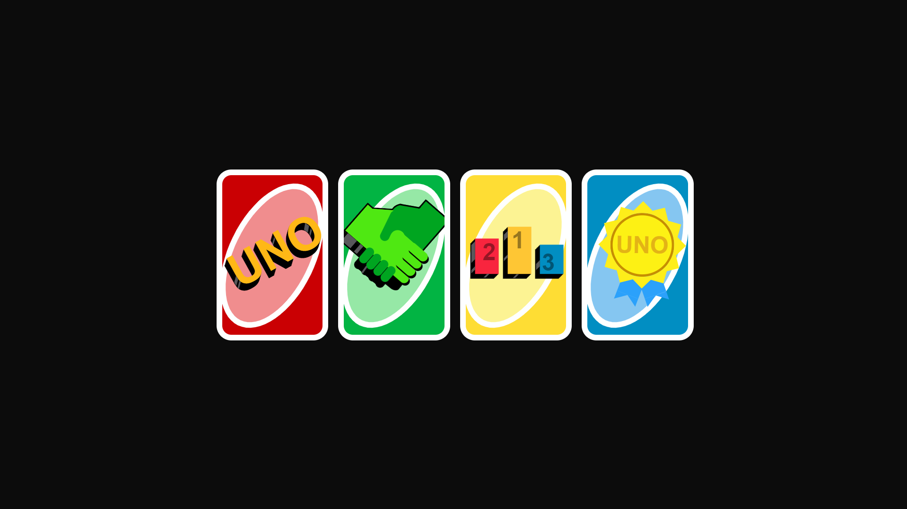
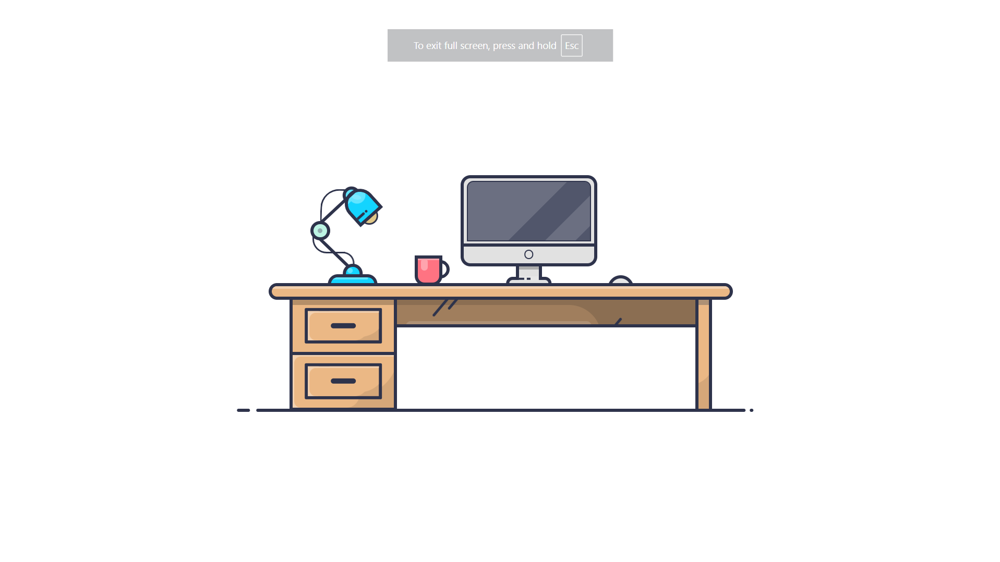
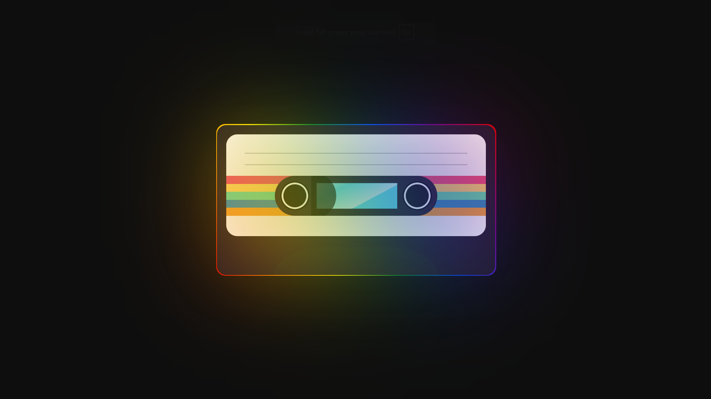

<h1 align=center>CSS Arts Gallery</h1>

Welcome to my **CSS Arts Gallery**, a collection of creative and experimental designs made entirely with **HTML** and **CSS** just pure code art.

This website is a personal project to showcase my passion for front-end development and the artistic side of CSS. Each piece is handcrafted to explore different techniques like animations, gradients, shapes, and more.
Check it out live here: [https://css-arts-gallery.netlify.app/](https://css-arts-gallery.netlify.app/)

---

### These are some of the arts I've made with CSS:

<table>
  <tr>
    <td></td>
    <td></td>
  </tr>
  <tr>
    <td></td>
    <td></td>
  </tr>
  <tr>
    <td></td>
    <td></td>
  </tr>
  <tr>
</table>
